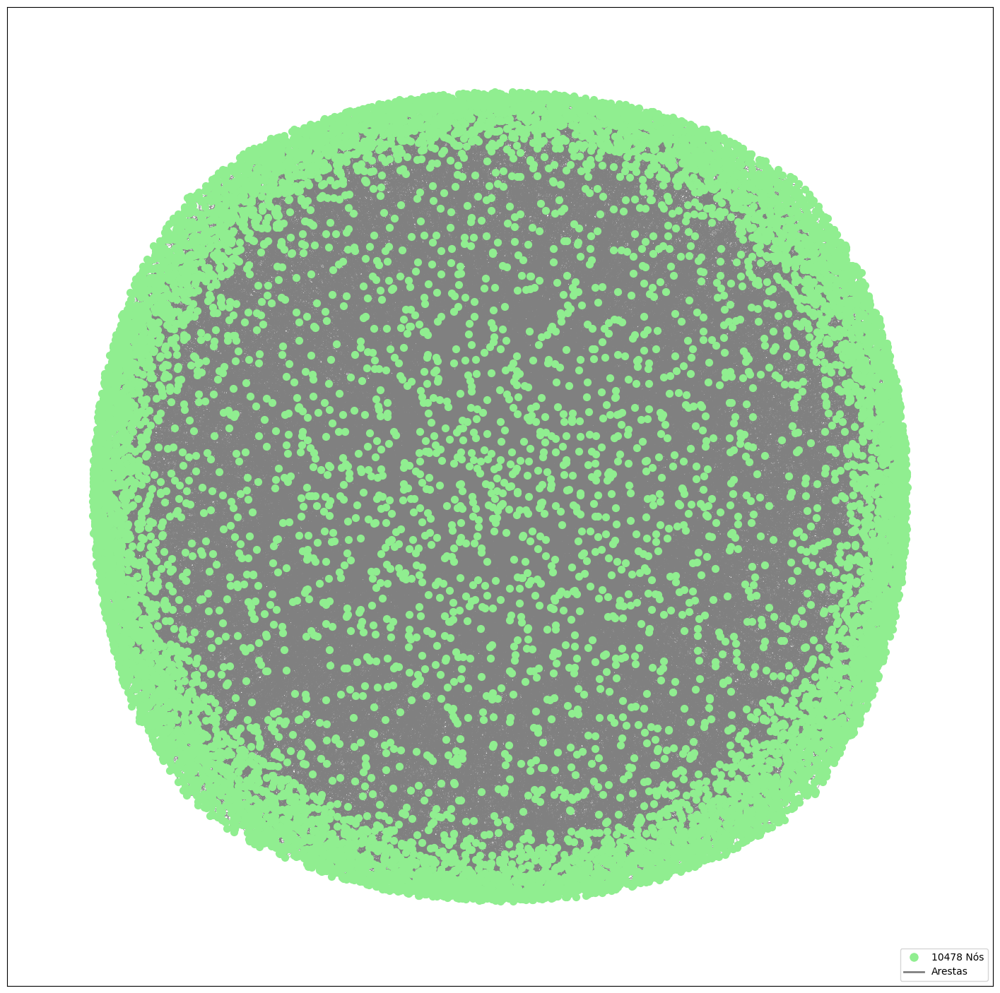
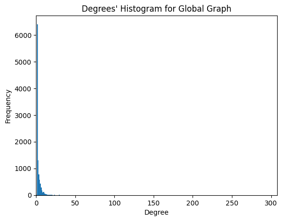
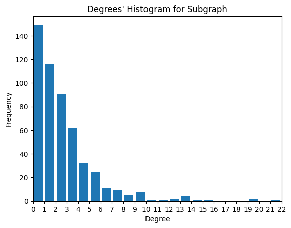

##Unity 1, Second activity

#This activity's objective is to reinforce graphs' concepts using NetworkX lib in Python. Using a data frame from the Scopus website a net of co-authors is created to represent how these authors interact with each other.

## Graph's representations

At first, a global graph is plotted to show how immense the network can be. 

Besides the quantity of nodes shown in the legend, there is no way of telling any other information visually. So we can select a portion of the global graph to see how this sub-group is represented.
Using NetworX's subgraph function it is possible to take some nodes and create another graph. Then we have it, a subgraph whose method of selection was to select nodes with 8 or more edges/neighbors.

It is possible to see more clearly the connections between nodes and how much there are. To have a numeric idea of the quantity of connections by node we can calculate the density using NetworkX's density function. The density value is shown in the legend of the image.

## Degrees' Distribution Histograms

To better visualize the main information of the data analyzed - the links between nodes - histograms were created to represent the degrees by nodes distribution. 

First, we have the global graph histogram: 

And the subgraph's histogram:

