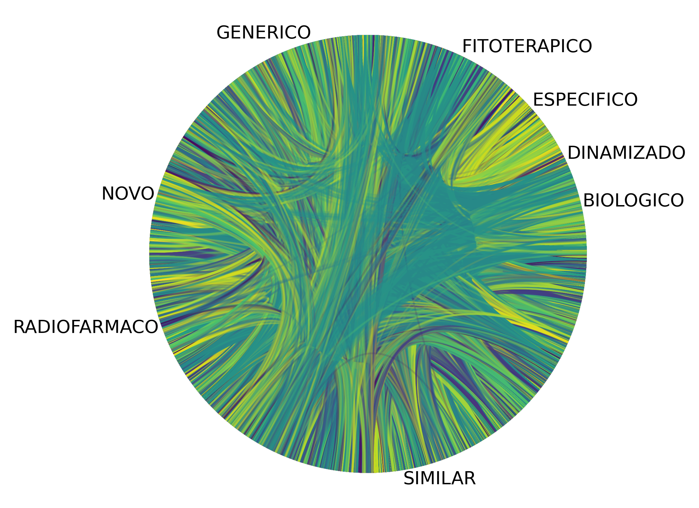
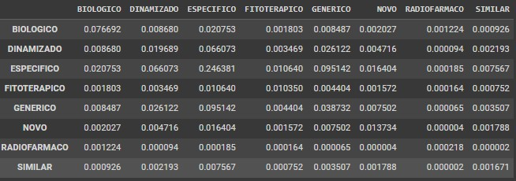

Discente: Pedro Henrique da Silva Santos

link do vídeo: [https://drive.google.com/file/d/1prFRt_8VccAxkefJ9nQaY2z9cUuodkhr/view?usp=drive_link
](https://drive.google.com/file/d/1prFRt_8VccAxkefJ9nQaY2z9cUuodkhr/view?usp=drive_link)

## Primeira Hipótese
Hipótese da Categoria Regulatória: Os medicamentos da mesma categoria regulatória tendem a compartilhar mais princípios ativos?

Para fazer a análise foi criado grafo onde os medicamentos são um nó e as ligações entre medicamentos representam princípios atívos iguais entre estes medicamentos.

Para fins de representação visual, o grafo pode ser visto na imagem abaixo: 

Não é possível fazer nenhuma análise a partir da imagem acima, além de que o grafo é um grafo bem denso dado a quantidade de nós - praticamente invisíveis na borda circular -  e suas ligações. As cores entre das arestas representam princípios atívos diferentes.

Para saber se elementos da mesma categoria comparilham princípios atívos neste caso, podemos usar a matriz de coeficientes de assortatividade a qual exibe em uma matriz as relações de elementos entre grupos. Neste caso, os grupos seriam as categorias.
A matriz de assortatividade ou mixing matriz resultante foi esta:

