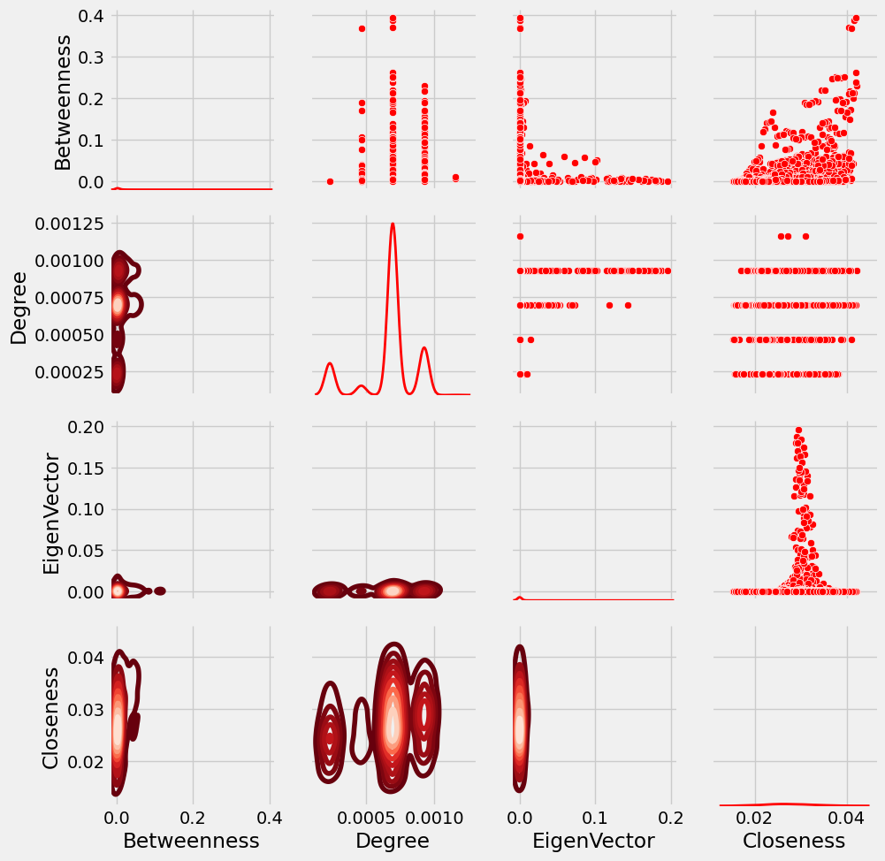
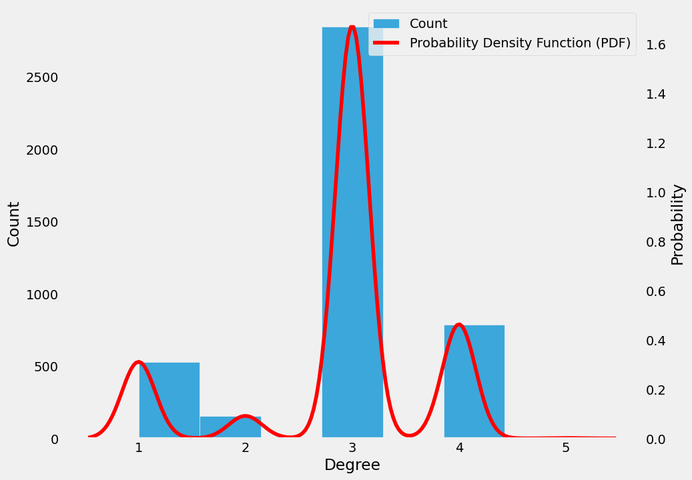
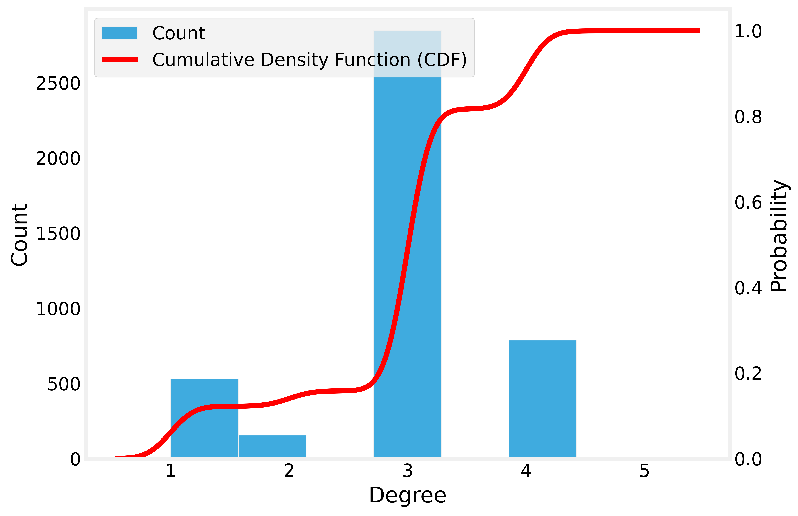
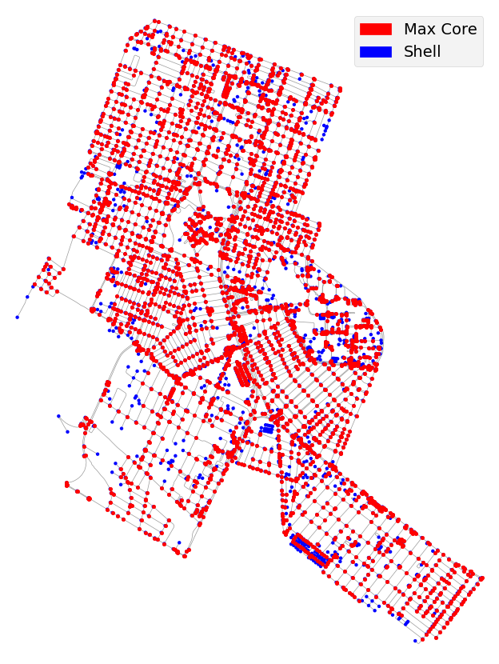

#### 

Objetivo: Avaliar a mobilidade no entorno da UFRN, em Natal-RN. 

- Quais bairros analisar?

- Onde eu poderia colocar dock-station(S) de compartilhamento de bicicletas?

- Desconsidere paradas de ônibus, tente resolver esse desafio usando o conteúdo visto nas aulas de 21 e 23 de novembro.

> Rede analisada na atividade:

> Exibindo a rede com os nós coloridos de acordo com o grau de centralidade dos nós. Foram plotados quatro gráfos para exibir a rede de diferente formas para melhor visualização dos graus de centralidade.

Fazendo uma valiação geral com base nas quatro representações gráficas de cada centralidade é possível inferir algumas possibilidades de instalação dos pontos de compartilhamento de bicicletas.

A partir da rede feita com as métricas de centralidade por grau do nó é possível ver que dentro da UFRN e nas vias ao redor dela há nós com vários caminhos - Centralidade por grau de aproximadamente 0.030 -, então, nestes lugares é possível instalar os pontos de compartilhamentos de bicicleta pois são pontos de fácil acesso e circulação.

A partir a da rede feita com as métricas de centralidade por proximidade é possível ver que os nós com baixo grau de centralidade são nós mais distantes da UFRN. Nesta rede a universidade não está exatamente no centro porém está próxima, possibilitando então fazer estimativas de pontos estratégicos. Colocar as estações de compartilhamento de bicicleta nas extremidades da rede - nas extremidades norte, oeste e sul da rede, ou seja, na extremidade dos bairros - iria possibilitar o livre circulação da população e uma menor lotação de transporte público. Utilizando as informações da primeira rede é possivel visualizar as avenidas/ruas estratégicas para terem as estações, como as ruas  com mais acesso - maior centralidade por grau.

Analisando a rede feita com a métrica *betweeness centrality* é possível ver que para os três bairros avaliados, os trechos com maior grau foram os nós que estão presentes na Av. Salgado filho, Nevaldo Rocha e Av. Engenheiro roberto Freire. Pontos de compartilhamento de bicicletas nestas avenidas podem ser avaliados pois são avenidas muito moviemetadas que passam por zonas residenciais e comerciais.

> Mais informações sobre a rede

- Relação entre centralidades.

- Curva da função de densidade de probabilidade e contagem de nós por grau
  

  
- Curva da função de distribuição acumulada

No gráfico de quantidade de nós por grau é possível ver que há uma número maior de nós com grau 3 e curva da densidade de probabilidade. No segundo gráfico é possível ver que boa parte da densidade se dá pela quantidade de nós com grau três e uma pequena fração se dá por nós com grau cinco.

  
  
