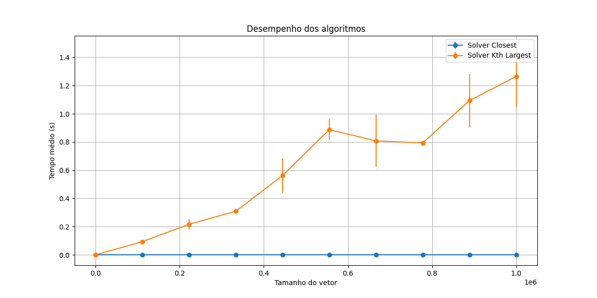

## Avaliação de complexidade de algorítmos

Link do vídeo:

O trabalho teve como objetivo analisar a complexidade dos algorítmos de busca em uma árvore de busca binária. O algoritmo solver_closest que busca o elemento com valor mais próximo de um alvo e o o algoritmo solver_kth_largest que recebe um inteiro N e busca o N-ésimo maior valor da BST.

 

  
